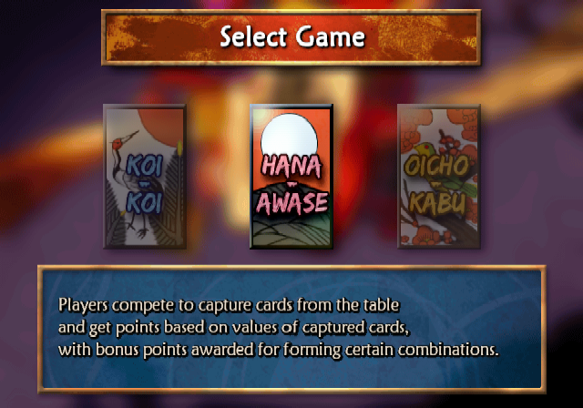
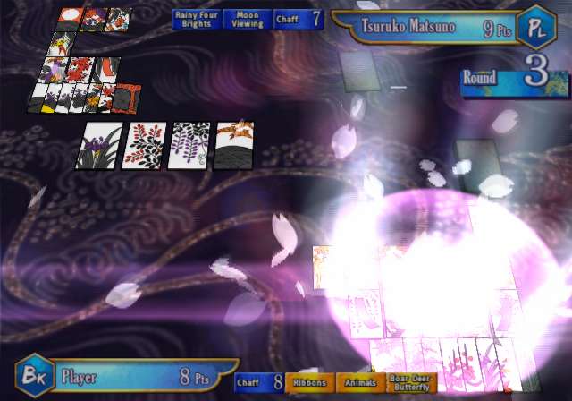

# SuperLite-2000-Table-Hanafuda-PS2-English-Translation-Patch
An English translation patch for "SuperLite 2000 Table Hanafuda" [SLPM-62487] PS2 game published by SUCCESS. \
All in-game text was translated from Japanese to English. \
Information provided by [Fuda Wiki](https://fudawiki.org/) was used for yaku names, game descriptions and some other game terminology. \
Patch is in xdelta format and was tested with MD5: 4c0c84f0314c37af9d272f23c355d064 copy of the game. \
Tools used: \
[MKPSXISO](https://github.com/Lameguy64/mkpsxiso) - extraction and rebuilding of BIN image. \
[Delta Patcher](https://github.com/marco-calautti/DeltaPatcher) - creation of patch file. \

